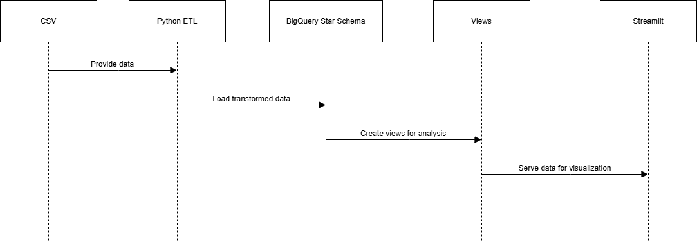
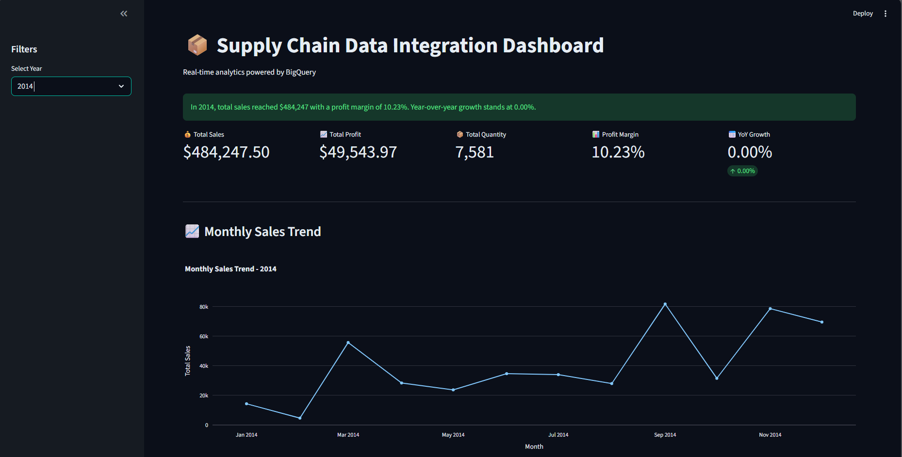
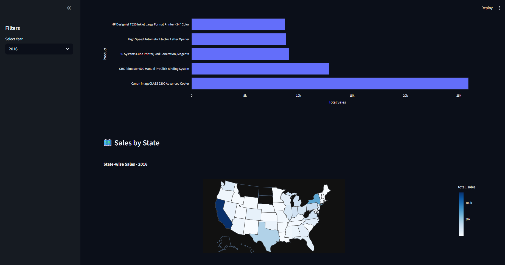

# Supply Chain Data Integration System

## Overview

- This project implements a Supply Chain Data Integration System using a dimensional data warehouse architecture in Google BigQuery and a real-time analytics dashboard built with Streamlit.

- The system integrates structured sales data and simulated product metadata, applies transformations using Python, models the data into a star schema, and exposes business insights through interactive visualizations.

## Architecture

Raw Data (CSV + API)
        ↓
Python ETL (Transformation & Surrogate Keys)
        ↓
Star Schema in BigQuery
        ↓
Analytical Views
        ↓
Streamlit Dashboard

## Architecture Diagram

## Data Model

### Fact Table
- fact_orders

### Dimension Tables
- dim_product
- dim_customer
- dim_date
- dim_location

## Tech Stack

- Python (ETL & Transformation)
- Google BigQuery (Data Warehouse)
- Streamlit (Dashboard)
- Plotly (Visualization)
- Pandas (Data Processing)
- Google Cloud SDK

## Run Locally

1. Clone the repository
2. Create virtual environment
3. Install dependencies:

   pip install -r requirements.txt

4. Set environment variables in .env

5. Run dashboard:

   streamlit run dashboard/app.py

## Dashboard Screenshots Preview

    
  

## Future Enhancements
- Add CI/CD pipeline
- Add Docker containerization
- Implement automated testing
- Deploy to Streamlit Cloud
