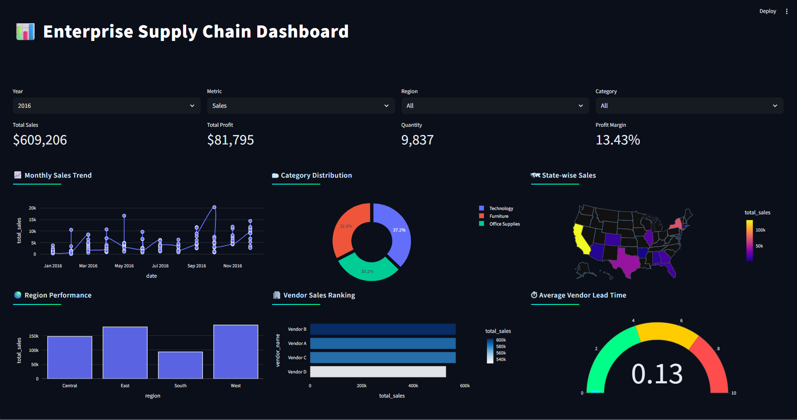

# 📦 Enterprise Supply Chain Data Integration System


---

## 🚀 Project Overview

An enterprise-style **Supply Chain Data Integration System** built using:

- **Google BigQuery** (Dimensional Data Warehouse)
- **Python ETL Pipelines**
- **Star Schema Modeling**
- **Streamlit + Plotly Executive Dashboard**

This project demonstrates a complete end-to-end data engineering workflow:

1. Multi-source data ingestion (CSV + API simulation)
2. Data transformation & surrogate key generation
3. Star schema modeling in BigQuery
4. Analytical data marts (views layer)
5. Interactive BI dashboard for executive insights

The system provides actionable analytics across:

- 📅 Time
- 🌎 Geography
- 📦 Product Categories
- 🏢 Vendors
- 📊 Sales & Profit Metrics
- ⏳ Lead Time Analysis
- 📦 Inventory Monitoring

---

# 🏗 System Architecture

Raw Data Sources (CSV + API Simulation)  
 ↓  
Python ETL (Transformation & Surrogate Keys)  
 ↓  
Star Schema in BigQuery  
 ↓  
Analytical Views (Data Marts)  
 ↓  
Streamlit Executive Dashboard

---

## 📐 Architecture Diagram


---

# 🗄 Data Warehouse Design

The warehouse follows a **Star Schema** architecture optimized for analytical workloads.

---

## ⭐ Fact Tables

### `fact_orders`

- Sales transactions
- Profit metrics
- Quantity sold
- Lead time days
- Clustered by `product_key` and `customer_key`

### `fact_inventory`

- Inventory quantity
- Stock metrics
- Inventory movement tracking

### `fact_vendor_performance`

- Vendor-level sales
- Average lead time
- Total orders handled

---

## 📦 Dimension Tables

- `dim_product`
- `dim_customer`
- `dim_date`
- `dim_location`
- `dim_vendor`

---

## 📊 Analytical Data Marts (Views)

The dashboard does **not query fact tables directly**.  
Instead, it uses optimized analytical views:

- `vw_sales_mart`
- `vw_region_sales`
- `vw_state_sales`
- `vw_product_performance`
- `vw_lead_time_analysis`
- `vw_vendor_performance`
- `vw_inventory_analysis`

This ensures clean separation between:

- Storage Layer
- Transformation Layer
- Presentation Layer

---

# 📈 Executive Dashboard Features

### 🎛 Dynamic Filters

- Year
- Region
- Category
- Metric selection (Sales / Profit)

### 📊 KPI Section

- Total Sales
- Total Profit
- Profit Margin
- Quantity
- Year-over-Year Growth

### 📈 Sales & Performance Analytics

- Monthly Trend Analysis
- Category Distribution (Donut Chart)
- State-wise Sales (USA Choropleth Map)
- Vendor Performance Comparison
- Lead Time Monitoring

### 📦 Supply Chain Insights

- Vendor ranking by sales
- Vendor lead time comparison
- Inventory analytics (via mart layer)

### 🎨 UI Enhancements

- Compact executive layout
- Card-based chart separation
- Optimized query performance
- BigQuery Storage API integration for faster data retrieval

---

# 🛠 Tech Stack

| Layer             | Technology        |
| ----------------- | ----------------- |
| Data Processing   | Python, Pandas    |
| Data Warehouse    | Google BigQuery   |
| Modeling          | SQL (Star Schema) |
| BI Dashboard      | Streamlit         |
| Visualization     | Plotly            |
| Cloud Integration | Google Cloud SDK  |
| Version Control   | Git & GitHub      |

---

# ⚙️ Engineering Decisions

### 🔹 Partitioning

Partitioning was initially implemented on `fact_orders`, but removed due to free-tier dataset retention constraints in BigQuery. Clustering remains enabled for performance optimization.

### 🔹 Mart-Driven Architecture

Dashboard queries only analytical views instead of raw fact tables to follow enterprise BI design standards.

### 🔹 Explicit Schema Definition

Fact tables use explicitly defined schemas instead of autodetect to ensure production-grade reliability.

---

## Dashboard Preview

<p align="center"> <br><br></p>

# ▶️ Run Locally

## 1️⃣ Clone Repository

```bash
git clone <your-repo-url>
cd Supply-Chain-Data-Integration-System
```

## 2️⃣ Create Virtual Environment

```python -m venv .venv
source .venv/bin/activate  # Mac/Linux
.venv\Scripts\activate     # Windows
```

## 3️⃣ Install Dependencies

`pip install -r requirements.txt`

## 4️⃣ Configure Environment Variables

Create a .env file:

````GCP_PROJECT_ID=your-project-id
BQ_DATASET=supply_chain_dw```

## 5️⃣ Run Dashboard
```streamlit run dashboard/app.py```


## 📌 Future Enhancements

- CI/CD pipeline integration

- Docker containerization

- Automated data validation tests

- Cloud deployment (GCP / Streamlit Cloud)

- Role-based access control

- Real-time streaming ingestion
````
